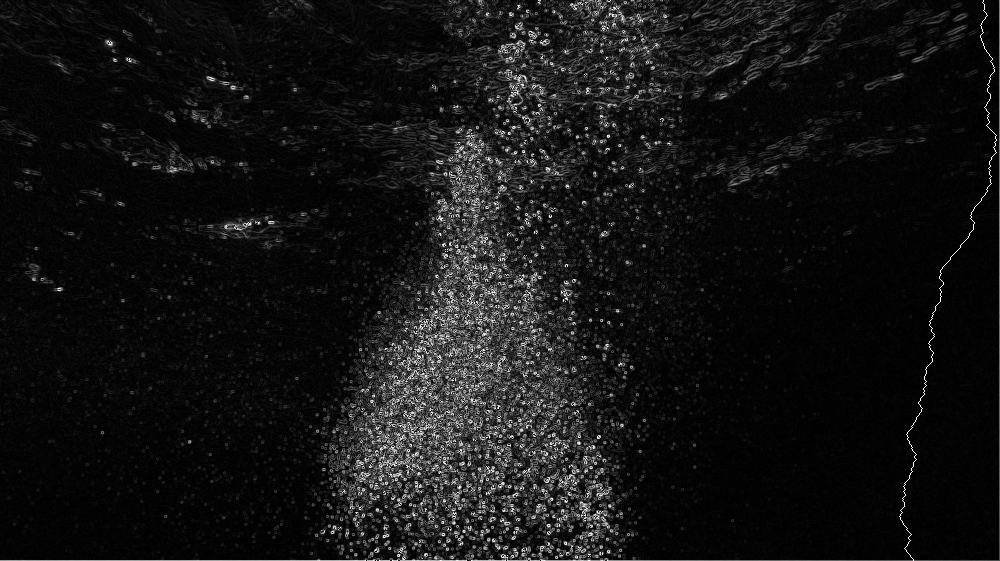

A simple go program that uses the Seam-Carving algorithm to remove pixels from an image (also called content-aware resizing).

This program includes a simple edge detection algorithm using the Sobel operator.

This program is not good. The algorithms were implemented from scratch to help me understand how the algorithm works.
It could also help you, so feel free to learn from it.

## How

We got an image such as:

and we calculate the entropy of each pixel and then find the lowest line from top to bottom (Seam) while only going only one pixel down or one pixel diagonal down. This results in a Seam line like here:

